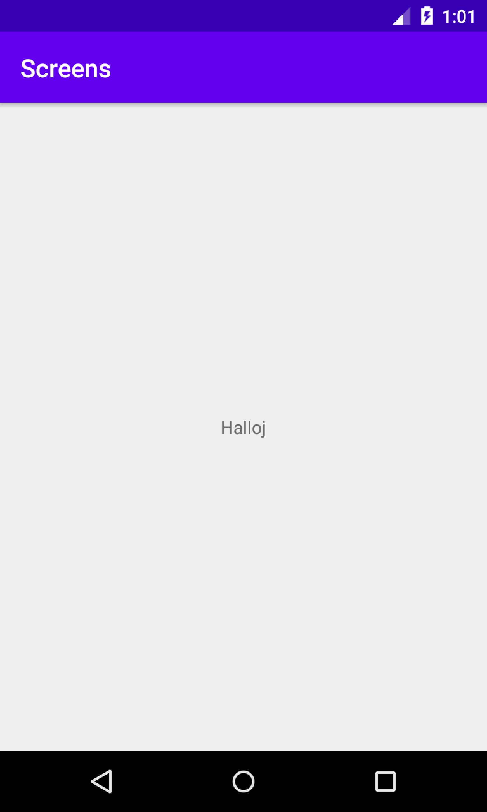

# Rapport

Jag forkade projektet från github.
Sedan skapade jag en andra activity och döpte den till SecondActivity.
Sedan skapade jag en knapp i activity_main.
Jag skapade en intent som öppar min andra activity, jag gav den även extras i form av namn(Halloj)och nummer(50).
Sedan satte jag intenten inom en onclick för knappen.
Min onclick ser ut så här:
```
Button button = findViewById(R.id.mainButton);
button.setOnClickListener(new View.OnClickListener() {
    @Override
    public void onClick(View view) {
        Intent intent = new Intent(MainActivity.this, SecondActivity.class);
        intent.putExtra("name", "Halloj");
        intent.putExtra("number", 50);
        startActivity(intent);
    }
});
```
sedan satte jag handlers i SecondActivity som hanterade extras från MainActivity

